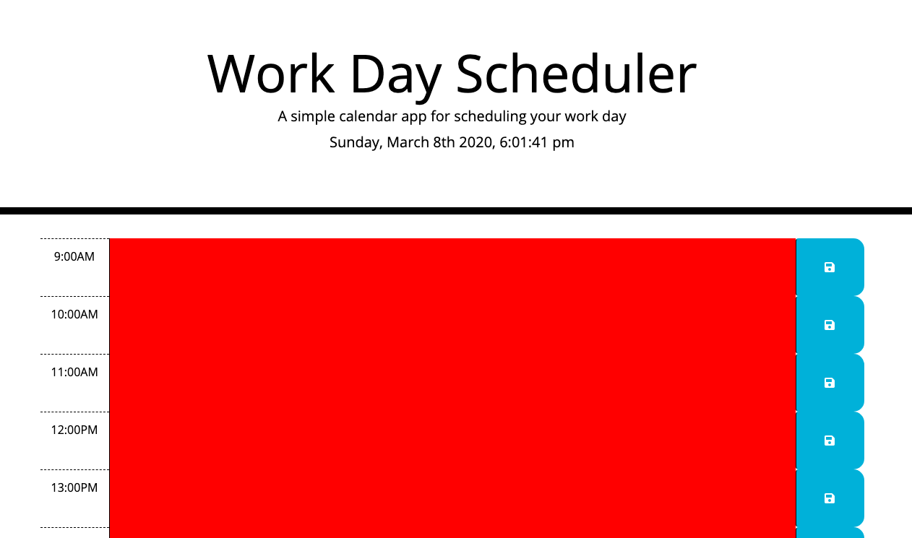

# Day-Planner

An simple application using Javvascript and Moment.js to save event in local storage.

User could store and edit event in each hour slot. 

The slot would change their color base on the current time.

* Blue - Future
* Green - Present
* Red - Past

